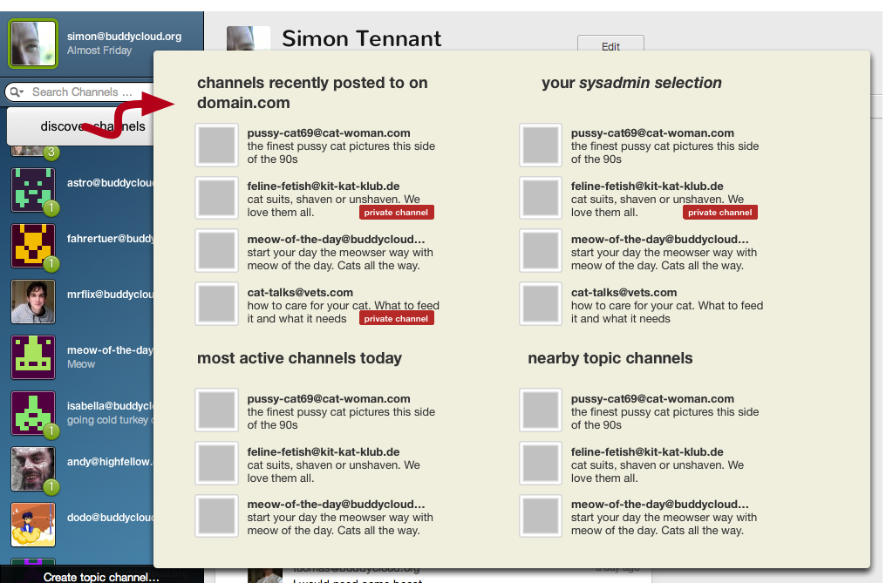
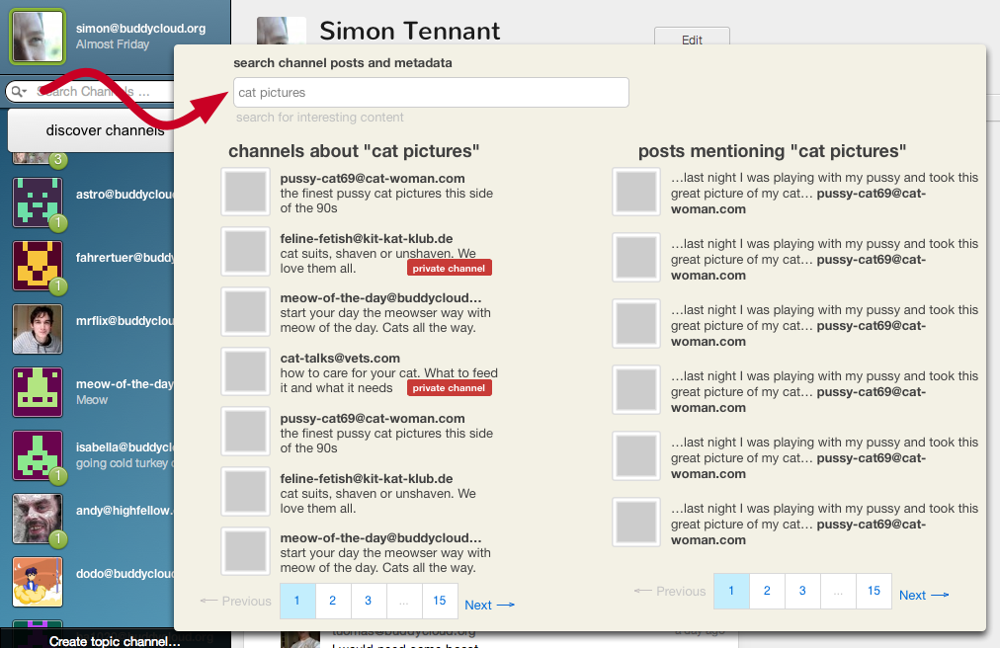
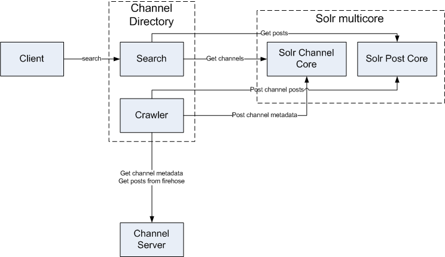

Related documentation
=====================

The channel Directory project comprises three areas:

Gathering

1.  spidering open channels for content and followers
2.  receiving posts via a firehose

Searching

1.  Finding nearby content
2.  Searching channel metadata
3.  Searching channel content

Recommending

1.  show me channels similar to this one
2.  based on the channels I follow, recommend more

In production
-------------

Here are a few nice query examples:

-   <http://crater.buddycloud.org:5000/search?page=0&q=imaginator>
-   <http://crater.buddycloud.org:5000/search?page=0&q=post%3A+christmas>
-   <http://crater.buddycloud.org:5000/search?page=0&q=metadata%3A+buddycloud>

Mockups
-------

### The project goals

When a user joins a new XMPP-based social network it's really important
to get them quickly hooked up with relevant/interesting content. The
user needs to have an almost immediate "this is cool" or "I didn't know
that there was other content or users nearby" moment in the first minute
of using a client.

The main goal of this project is to build a distributed directory
service that would run as an XMPP component. That would enable users to
easily find interesting content on pub-sub nodes in the XMPP space.

While XMPP and the web are great examples of a distributed architecture,
it also makes sense to have systems that have an overview of where
content is (web search engines) and to be able to recommend content
based on a taste-engine.

Pub-Sub is becoming increasingly used in by projects like buddycloud and
in the PEP form for OneSocialWeb.

This project will focus on exposing interesting content hidden away in
pub-sub nodes by looking at node subscription data and node metadata.

In this project we will build a service that will be notified when new
pub-sub nodes are created. The service will then build up a map of nodes
and regularly crawl them to investigate subscribers and metadata.

Users will interact with the service through a (to be definied and
perhaps XEPd) protocol that let’s them query for similar content based
on a project like the Mahout taste engine.

### Potential use cases

Pub-sub server operators would select a node running the service as the
recommended directory service to find pub-sub nodes. Pub-sub clients
query the directory service for "show me content nearby to lat/long",
"show me content similar to beer@budvar.cz". Queries to the directory
service should return lists of nodes based on nearby-ness, popularity,
or even taste.

This pub-sub search engine is supposed to be reused by any pub-sub based
social network using the XMPP protocol. That will help to make XMPP a
viable way to deliver and search for relevant content.

As mentioned before, users may be recommended to relevant content by
location, popularity, taste similarity, friends’ taste and so on. The
directory server is supposed to index metadata from pub-sub nodes. When
pub-sub nodes are created and updated, and have an open access model,
their existence and metadata are sent to the directory server. The
server should then maintain a reasonably current list of all the open
access pub sub nodes and their indexed metadata, ready for client
queries.

The users’ taste learning machine is supposed to be built over [Apache
Mahout](http://mahout.apache.org/) and query syntax will use the
specification in [10] as a starting point.

### Roadmap

During the Community Bonding Period specific details regarding the API
of the directory server, syntax of the queries, the database schema,
technologies (language, libraries, DBMS) to be used are to be decided.
Below are the steps we are planning to take during this project:

​1. Plan a set of XMPP queries and study Apache Mahout and relate it to
content indexing and taste learning in this project (23rd May).

In this step we will study how Apache Mahout works. We intend to use
this software for the user taste use case: Recommendation mining takes
users' behavior and from that tries to find items users might like.
Mahout is scalable, what is crucial in a service that is supposed to
deal with metadata related to a huge number of users and nodes. Usage
demos are the main artifacts produced during this week.

​2. With the API defined, setup the XMPP communication stack and the
database objects (30th May)

This step involves setting up the communication stack, or, in other
words, to make the service ready to communicate with pub-sub clients and
servers easily. In this step, we also need to implement the database
access layer based on the schema defined during the community bonding
period. The main challenge of this step is to create reliable, clean and
easy to use ways of accessing the communication and database layers.
That will require constant refactoring during the project though.

​3. Write the pubsub node create callback method and the crawling
mechanism (6th June)

These methods will allow for metadata gathering and indexing. Whenever a
node is created in the pubsub servers reporting to the directory
service, this method will be invoked. Then, the service is supposed to
keep a node list with their metadata. Also, a crawling mechanism must be
written to regularly query for metadata updates in the monitored nodes.

This step may bring an scaling problem, since a huge number of nodes
creation/update may overhead the server. We must notice that the user
query response time must be kept low, so indexing tasks may be cached
and have a lower priority.

​4. Implement pub-sub node query based on node location (20th June)

This query syntax will be similar to the already proposed
[specification](http://buddycloud.org/wiki/Channel_Directory). Users may
search for nodes located near them, or nodes located near an specific
place in a specific range. The server then returns a list of the pub-sub
nodes that complies with the location query. Depending on how much
location information a client is willing to give, we may need to use
reverse geolocation APIs, such as Google’s or OpenStreetMap.

​5. Implement pub-sub node query based on node content: subscription
data and metadata (27th June)

When queried for an specific content, the service is supposed to search
through all metadata information of all pub-sub nodes in order to return
the nodes that may provide that content. The challenge of this step
relies on the query response time degradation. We may already include
Apache Mahout during this step.

​6. Implement user query based on his previous tastes (4th July)

Include Apache Mahout. In this step we will include the Mahout learning
machine, based on the demos we have written in the first step. That will
allow the service to give the user recommendations based on his taste,
or, more generally, given a jid, return other pub-sub nodes that would
be interesting.

​7. Implement user query based on node popularity (25th July)

Also, pub-sub nodes may be classified according to their popularity. In
this step we will define a metric for nodes’ popularity and then include
this information to the stored metadata. This metric can be as simple as
a subscriber count or something more complex, like Google’s PageRank
algorithm. The level of difficulty in this step will be proportional to
the complexity of the metric chosen.

​8. Evaluate the performance of the server (4th August)

In this step we will evaluate the response time degradation with a
gradual increase in requests. We expect the system to perform well (do
not degrade user experience) up to a rate of 1k queries/seconds. If the
system performs worse than expected, this step will involve
investigating and fixing what is causing poor performance. Some database
techniques may be applied during this step, such DBMS tuning, caching,
indexing and paging.

All implementation steps mentioned aboved are to be guided by tests.

Architecture
------------

PubSub Requirements
-------------------

The following pubsub methods are required for the channel directory to
work:

-   [Discover
    nodes](http://xmpp.org/extensions/xep-0060.html#entity-nodes)
-   [Discover node
    metadata](http://xmpp.org/extensions/xep-0060.html#entity-metadata)
-   [Discover items for a
    node](http://xmpp.org/extensions/xep-0060.html#entity-discoveritems)
-   [Retrieve
    subscriptions](http://xmpp.org/extensions/xep-0060.html#entity-subscriptions)
-   [Retrieve
    affiliations](http://xmpp.org/extensions/xep-0060.html#entity-affiliations)
-   [Retrieve items from a
    node](http://xmpp.org/extensions/xep-0060.html#subscriber-retrieve)
    -   That requires RSM to be implemented, once the crawler won't
        retrieve all node items every time

The firehose node is supposed to be named as /firehose, as for
[https://buddycloud.org/wiki/XMPP\_XEP\#Firehose](https://buddycloud.org/wiki/XMPP_XEP#Firehose)

Although recommended, the firehose node is optional.
